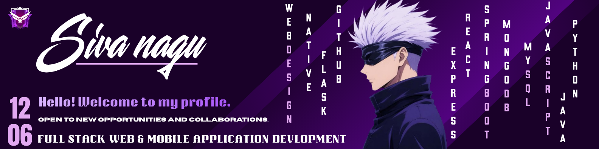

<div align="center">



<br/><br/>


</div>

<div align="center">

`PROFILE — INDEX N° 001` &nbsp;•&nbsp; `KURELLGUDEM, ANDHRA PRADESH — IN`

</div>

---

<div align="center">

# Pamarthi Leela Venkata Siva Nageswararao

**Full Stack Developer — Andhra Pradesh, India**

`focus` &nbsp;›&nbsp; full-stack systems · API architecture · machine learning · mobile applications
<br/>
`status` &nbsp;›&nbsp; open to full-time roles · freelance · collaboration

</div>

<div align="center">


</div>

---

## `01` &nbsp; SOCIAL LINKS &nbsp;&nbsp;<sub>`~/01-connect`</sub>

<div align="center">

[](https://www.linkedin.com/in/siva-nagu-5b8279381)
[](mailto:pamarthisiva144@gmail.com)
[](https://portfolio-p1zu.onrender.com/)
<br/>
[](https://stackoverflow.com/users/32143651/siva-028-cm-60)
[](https://www.instagram.com/sivanagu_origin_1206)
[](tel:+919381644896)

</div>

---

## `02` &nbsp; ABOUT ME &nbsp;&nbsp;<sub>`~/02-whoami`</sub>

Final-year Computer Science undergraduate at Sri Vasavi Engineering College, building across the
full stack — React and React Native on the client, Node.js, Flask and Django on the server,
MongoDB and MySQL underneath. I design APIs that stay predictable under load, and I train and
deploy machine-learning models that ship inside real products rather than notebooks.

I care about clean architecture and user experience in equal measure.

```typescript
const sivanagu = {
  name      : "Pamarthi Leela Venkata Siva Nageswararao",
  alias     : "Siva Nagu",
  location  : "Kurellgudem, Andhra Pradesh, India",
  education : "B.Tech @ Sri Vasavi Engineering College — 8.18 CGPA",
  roles     : ["Full Stack Developer", "API Architect", "ML Engineer"],
  passion   : "Building scalable systems that solve real-world problems",
  status    : "Open to full-time & freelance opportunities",

  expertise : {
    frontend  : ["React", "Next.js", "React Native", "Three.js", "GSAP"],
    backend   : ["Node.js", "Flask", "Django", "FastAPI", "Spring"],
    databases : ["MongoDB", "MySQL", "SQLite", "Firebase"],
    cloud     : ["AWS", "Google Cloud", "Vercel", "Netlify"],
    ai_ml     : ["TensorFlow", "PyTorch", "Scikit-learn", "OpenCV"],
  },

  funFact   : "Trained an ML model and won a hackathon in the same month.",
};
```

| | |
|:---|:---|
| **FOCUS** | Full-Stack Systems · API Architecture · AI / ML · Mobile Applications |
| **STATUS** | Open to internships · full-time roles · freelance · collaboration |
| **BASE** | Kurellgudem, Andhra Pradesh, India |

---

## `03` &nbsp; ACHIEVEMENTS & RECOGNITION &nbsp;&nbsp;<sub>`~/03-recognition`</sub>

| Achievement | Details |
|:---|:---|
| **CSE Department Hackathon — 2nd Prize** | Developer & Team Lead · 26 October 2024 |
| **Oracle Cloud Generative AI Professional** | Certified · 14 August 2025 |
| **LeetCode** | 90+ problems solved |
| **GeeksForGeeks** | 800+ score |
| **MongoDB Python Developer Path** | Completed · 14 May 2025 |
| **Kaggle Python Certification** | Completed · 25 February 2024 |
| **Udemy CSS Crash Course** | Completed · 26 September 2024 |

---

## `04` &nbsp; TECH ARSENAL &nbsp;&nbsp;<sub>`~/04-stack`</sub>

**FRONTEND**


**BACKEND**


**DATABASE & CLOUD**


**AI / ML & DATA SCIENCE**


**TOOLS & DEVOPS**


**DESIGN & CREATIVE**


---

## `05` &nbsp; FEATURED PROJECTS &nbsp;&nbsp;<sub>`~/05-projects`</sub>

> Complete catalogue → **[portfolio-p1zu.onrender.com](https://portfolio-p1zu.onrender.com/)**

**01 / NUMBER GUESSING GAME**
<br/>
Full-stack game platform with authenticated sessions, a persistent leaderboard and AI-assisted hint generation.
<br/>
`REACT · FLASK · MONGODB · JWT` &nbsp;—&nbsp; [Live](https://numberguessingversion2-1.onrender.com/)

---

**02 / ANIME STREET STYLE**
<br/>
Anime-inspired commerce storefront driven by dynamic product APIs and Context API state management.
<br/>
`REACT · VITE · TAILWIND · BOOTSTRAP` &nbsp;—&nbsp; [Live](https://animestreetstyle.onrender.com/)

---

**03 / TOURIST & TRAVELLISM**
<br/>
AI travel planning platform with JWT authentication, Gemini-generated itineraries and Cloudinary media pipeline.
<br/>
`REACT · PHP · MONGODB · GEMINI AI` &nbsp;—&nbsp; [Live](https://touristandtravellismfrontendversiontwo.onrender.com/)

---

**04 / REALTIME CHAT APPLICATION**
<br/>
Production-grade WebSocket messaging with presence, media uploads and Zustand-driven client state.
<br/>
`MERN · SOCKET.IO · ZUSTAND · JWT` &nbsp;—&nbsp; [Live](https://chatty-m2s3.onrender.com/)

---

**05 / AI VOICE ASSISTANT**
<br/>
Desktop assistant combining face authentication, speech recognition and a native-feel GUI layer.
<br/>
`PYTHON · GEMINI API · EEL` &nbsp;—&nbsp; [Demo](https://www.youtube.com/watch?v=ZeyRsR7yOzI)

---

**06 / ACNE DETECTION (MACHINE LEARNING)**
<br/>
Classification model grading mild, moderate and severe cases, served through a Flask web interface.
<br/>
`PYTHON · FLASK · SCIKIT-LEARN` &nbsp;—&nbsp; [Live](https://acne-app-detector-using-machine-learning-ye4e.onrender.com/)

---

**07 / PERSONAL PORTFOLIO**
<br/>
Personal site with theme switching, motion-led transitions and integrated contact delivery.
<br/>
`HTML · CSS · JAVASCRIPT` &nbsp;—&nbsp; [Live](https://portfolio-p1zu.onrender.com/)

---

## `06` &nbsp; GITHUB ANALYTICS &nbsp;&nbsp;<sub>`~/06-telemetry`</sub>

<div align="center">


<br/><br/>


<br/><br/>


<br/>


</div>

---

## `07` &nbsp; EDUCATION &nbsp;&nbsp;<sub>`~/07-education`</sub>

```
Sri Vasavi Engineering College, Tadepalligudem
B.Tech · Computer Science · 2024 – 2027         CGPA  : 8.18    ██████████░

Sir C R Reddy Polytechnic, Eluru
Diploma in Computer Science · 2021 – 2024       SCORE : 73.3%   ███████░░░░

Z.P.H.S Kurellagudem
SSC · 2020 – 2021                               GPA   : 9.7     █████████░░
```

---

## `08` &nbsp; EXPERIENCE &nbsp;&nbsp;<sub>`~/08-route`</sub>

**2023 – 2024 &nbsp;·&nbsp; My Access Private Limited — Bhimavaram**
<br/>
*Trainee, Python Full Stack Development · November 2023 – April 2024*

- Completed an intensive Python full-stack programme spanning frontend, backend and database fundamentals.
- Built a **Spam Email Detection** model with Scikit-learn, Pandas and NumPy, evaluated end to end.
- Earned the course completion certificate following successful project review.

---

## `09` &nbsp; CURRENT OBJECTIVES &nbsp;&nbsp;<sub>`~/09-goals`</sub>

- Designing production-ready microservice architectures.
- Deepening expertise in advanced system design patterns.
- Exploring Web3 and blockchain infrastructure.
- Contributing consistently to open-source projects.
- **Available for hire — full-stack, API and machine-learning engagements.**

---

## `10` &nbsp; CONTACT &nbsp;&nbsp;<sub>`~/10-connect`</sub>

<div align="center">

**Always open to substantive conversations and collaboration.**

[](mailto:pamarthisiva144@gmail.com)
[](https://www.linkedin.com/in/siva-nagu-5b8279381)
<br/>
[](https://portfolio-p1zu.onrender.com/)
[](https://www.instagram.com/sivanagu_origin_1206)

<br/>


<sub>Crafted by **Siva Nagu** · Kurellgudem, Andhra Pradesh, India · © 2026</sub>

</div>
